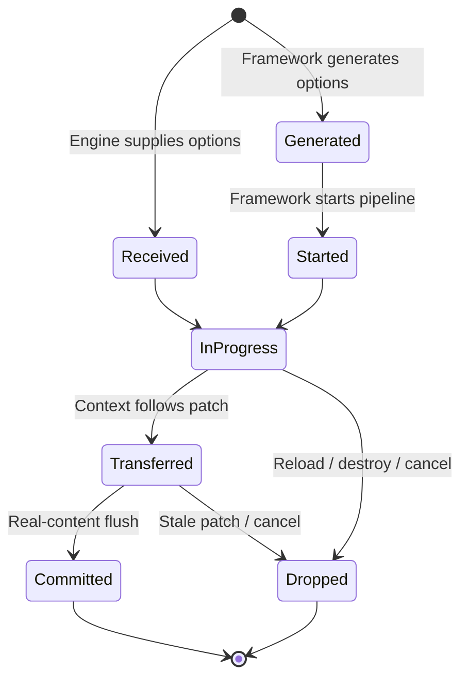

# Integrating a Custom Framework with the Performance API

This guide is intended for [Scripting Framework Developers](../../spec.mdx#scripting-framework-developer) who build a framework on top of the Lynx Platform and use low-level [Element PAPI](../../../api/engine/element-api.md) to implement rendering.

Application developers who use ReactLynx do not need to perform the integration described in this guide.

A custom framework commonly performs the following work:

- evaluates application scripts and computes UI changes;
- transfers changes between the Background Thread and the Main Thread;
- manipulates the Element Tree through Element PAPI; and
- calls [`__FlushElementTree`](../../../api/engine/element-api/__FlushElementTree.mdx) to submit those changes.

To produce complete [`PipelineEntry`](../../../api/lynx-api/performance-api/performance-entry/pipeline-entry.mdx) data, the framework must also associate its Framework Rendering work with the Pixel Pipeline that displays the corresponding changes.

:::warning Version and API stability

The first-screen integration described in this guide has been validated with Lynx 4.0.1 in Android and iOS Release builds.

The framework performance hooks and `__FlushElementTree` use underscore-prefixed names. They are integration APIs for Scripting Framework Developers, not application APIs. Their minimum-version information, compatibility data, and framework-neutral type source still require confirmation.

Until that contract is available, this integration should be documented as experimental and version-bound.

:::

## Documentation map

This guide uses existing Lynx documentation as the source of truth where a public definition is available. A **To be added** label means the integration still depends on an Engine callback contract that has no dedicated public API reference.

| Contract area                                                                     | Source of truth                                                                            | Status          |
| --------------------------------------------------------------------------------- | ------------------------------------------------------------------------------------------ | --------------- |
| Pipeline, Framework Rendering, Pixel Pipeline, threads, scripts, and Element Tree | [Lynx Living Specification](../../spec.mdx#pipeline)                                       | Documented      |
| Element creation and mutation functions                                           | [Element PAPI](../../../api/engine/element-api.md)                                         | Documented      |
| `__lynx_timing_flag`                                                              | [`<view>` attribute reference](../../../api/elements/built-in/view.mdx#__lynx_timing_flag) | Documented      |
| Performance entries and observation                                               | [Performance API](./performance-api.mdx)                                                   | Documented      |
| `renderPage`, `updatePage`, and `updateGlobalProps` framework callback options    | This guide                                                                                 | **To be added** |
| `PipelineOptions`                                                                 | [`PipelineOptions`](../../../api/lynx-api/performance-api/pipeline-options.mdx)            | Documented      |
| `FlushOptions` and `__FlushElementTree`                                           | [`__FlushElementTree`](../../../api/engine/element-api/__FlushElementTree.mdx)             | Documented      |
| Underscore-prefixed framework performance hooks                                   | [`lynx.performance`](../../../api/lynx-api/lynx/lynx-performance.mdx)                      | Documented      |

## Integration goals

After the integration is complete:

1. first-screen rendering produces a `pipeline.loadBundle` entry;
2. a re-rendering pipeline carrying a non-empty `__lynx_timing_flag` produces a `PipelineEntry`;
3. the entry contains the applicable Framework Rendering and Pixel Pipeline timing points;
4. the same completed pipeline can be observed through the scripting Performance API and the native performance callback; and
5. placeholders, empty changes, reloads, and destroyed pages do not consume or reuse an unrelated pipeline.

## Prerequisite concepts

This guide uses the definitions of [Lynx Pipeline](../../spec.mdx#lynx-pipeline), [First-screen Rendering](../../spec.mdx#first-screen-rendering-or-fsr), [Re-rendering](../../spec.mdx#re-rendering), [Framework Rendering](../../spec.mdx#framework-rendering), [Pixel Pipeline](../../spec.mdx#pixel-pipeline), [Main Thread](../../spec.mdx#main-thread-or-lynx-main-thread), [Background Thread](../../spec.mdx#background-thread-aka-off-main-thread), [Main Thread Script (MTS)](../../spec.mdx#main-thread-script-or-mts), [Background Thread Script (BTS)](../../spec.mdx#background-thread-script-or-bts), [Element Tree](../../spec.mdx#element-tree), and [Element PAPI](../../spec.mdx#element-papi) from the Lynx Living Specification.

For this integration, the important invariant is that the same pipeline context follows a logical UI change across framework stages, thread boundaries, and the Element Tree flush that submits that change.

## Performance integration model

### Roles and responsibility boundaries

| Role                          | Responsibility in this integration                                                                                            |
| ----------------------------- | ----------------------------------------------------------------------------------------------------------------------------- |
| Lynx Developer                | Marks rendering work that matters to the application and consumes PerformanceEntry objects.                                   |
| Scripting Framework Developer | Implements Framework Rendering and associates it with the corresponding Pixel Pipeline.                                       |
| Framework                     | Encapsulates Lynx Platform APIs into DSL-specific APIs and synchronizes its internal UI representation with the Element Tree. |
| Engine                        | Performs pixeling, records Engine timing points, and emits completed PerformanceEntry objects.                                |
| Native Developer              | Integrates Lynx with the Host Platform and may consume performance events through a LynxView client.                          |

An application must not call the underscore-prefixed framework performance hooks. A custom framework must not generate its own `pipelineID` or synthesize Engine timing points.

### Performance API and Framework Integration Hooks

The integration involves two API groups with different audiences:

- The **Performance API** is the public observation API. It includes PerformanceEntry types, `PerformanceObserver`, and the native `onPerformanceEvent` callback.
- The **Framework Integration Hooks** allow a framework to create, start, identify, and annotate framework-originated pipelines.

Observing performance entries does not associate Framework Rendering with a Pixel Pipeline. Calling the framework hooks without submitting the matching Element Tree changes does not produce a complete PipelineEntry.

### Framework timing boundaries

For a background-driven framework, this process commonly includes:

1. computing a UI diff on the Background Thread;
2. serializing the resulting changes;
3. transferring those changes to the Main Thread;
4. parsing the changes on the Main Thread; and
5. applying Element Tree operations.

The Performance API cannot infer these framework-specific stages. The framework records them through `_markTiming`.

A custom framework may use Main Thread Rendering or [Background-driven Rendering](../../spec.mdx#background-driven-rendering). Whenever rendering crosses a thread, queue, or asynchronous boundary, the pipeline context must cross the same boundary as the UI changes.

### Element submission boundary

The Element PAPI reference documents creation and mutation functions such as [`__CreateElement`](../../../api/engine/element-api/__CreateElement.mdx), [`__AppendElement`](../../../api/engine/element-api/__AppendElement.mdx), [`__SetAttribute`](../../../api/engine/element-api/__SetAttribute.mdx), and [`__RemoveElement`](../../../api/engine/element-api/__RemoveElement.mdx). [`__FlushElementTree`](../../../api/engine/element-api/__FlushElementTree.mdx) defines the submission boundary and its framework-facing options.

The framework associates its Element Tree changes with the Pixel Pipeline by passing `pipelineOptions` to the `__FlushElementTree` call that submits those changes. It must not use `_markTiming` to record Engine-owned Pixel Pipeline stages.

The following terms are specific to this integration:

- A **patch** is a framework-defined representation of UI changes. A background-driven framework commonly produces and serializes it in BTS, then parses and applies it in MTS.
- A **placeholder** is temporary UI submitted before the intended application content is ready. Unless the product defines it as the actual first-screen content, it must not consume the load pipeline by itself.
- **Hydration** is the framework process that reconciles one runtime's UI representation with an existing snapshot or Element Tree owned by another runtime.

The integration does not prescribe a patch format or an Element Tree update algorithm. It requires only that the pipeline context follow the same logical change until that change is submitted.

### Pipeline and flush

A **pipeline** is a logical attribution unit that extends from a rendering trigger to displayed output. A **flush** is a commit boundary for Element Tree changes.

Calling `__FlushElementTree` does not necessarily mean that a business pipeline has reached its intended output. A placeholder flush, an empty batch, or an internal-only flush might not submit the content represented by a pending pipeline.

A framework must therefore:

- attach a pipeline to the flush that submits its corresponding changes;
- avoid consuming a pending load pipeline with a placeholder or an empty batch;
- release a pipeline after its effective flush;
- drop a pending pipeline when its page is destroyed or replaced; and
- never reuse a pipeline for an unrelated re-rendering operation.

### Engine-initiated and framework-initiated pipelines

Pipelines have two initiation modes.

| Initiation mode     | Creator and starter | Framework responsibility                                                                                                                   |
| ------------------- | ------------------- | ------------------------------------------------------------------------------------------------------------------------------------------ |
| Engine-initiated    | Lynx Engine         | Preserve the received `PipelineOptions` and pass them to the matching flush. Do not generate or start another pipeline.                    |
| Framework-initiated | Custom framework    | Generate options, populate framework-owned metadata, start the pipeline, mark framework stages, transfer the options, and flush with them. |

The initial `loadBundle` pipeline and pipelines triggered by Native updates or Global Props are normally Engine-initiated. A normal application-state update originating in BTS is normally framework-initiated.



An Engine-initiated pipeline is already started when the framework receives it. A framework-initiated pipeline must move from `Generated` to `Started` exactly once. Each pipeline must eventually be committed once or dropped.

### Timing point, Timing Flag, and identifier

These concepts serve different purposes.

| Concept                                                                   | Meaning                                                                                                                                                                                                                                                                |
| ------------------------------------------------------------------------- | ---------------------------------------------------------------------------------------------------------------------------------------------------------------------------------------------------------------------------------------------------------------------- |
| Timing point                                                              | The time at which a Framework Rendering stage starts or ends, such as `diffVdomStart`. The framework records it through `_markTiming`.                                                                                                                                 |
| [Timing Flag](../../../api/elements/built-in/view.mdx#__lynx_timing_flag) | An application-provided non-empty string, such as `__lynx_timing_flag="feed-ready"`, that marks the Lynx Pipeline in which the element participates. When the element completes its final painting phase, the Engine can generate a `PipelineEntry` for that pipeline. |
| `identifier`                                                              | The `PipelineEntry` field used to identify a flagged pipeline. For such a pipeline, it equals the effective Timing Flag value.                                                                                                                                         |

A framework might discover a Timing Flag only while diffing the UI. To preserve the beginning of the diff, the framework records `diffVdomStart` before discovery and enables detailed timing when it finds an effective flag.

## Data contracts

### `PipelineOptions`

[`PipelineOptions`](../../../api/lynx-api/performance-api/pipeline-options.mdx) defines the fields, origins, ownership rules, and lifecycle of the correlation context that connects Framework Rendering to the Pixel Pipeline.

The integration must transfer the complete object or a complete structured copy. It must not transfer only `pipelineID` or discard fields it does not recognize.

### `FlushOptions`

[`FlushOptions`](../../../api/engine/element-api/__FlushElementTree.mdx#options) configures an `__FlushElementTree` submission. Its `pipelineOptions` field associates that submission with a pipeline.

The integration must merge `pipelineOptions` into the framework's existing flush options. It must not overwrite layout, list, asynchronous-flush, or data-update options.

The first argument to `__FlushElementTree` determines the existing whole-tree or subtree flush scope. Performance integration must not change that scope.

### `FrameworkPipelineTiming`

[`FrameworkPipelineTiming`](../../../api/lynx-api/performance-api/framework-pipeline-timing.mdx) contains timing data contributed by the framework.

| Data              | Source                                                                          |
| ----------------- | ------------------------------------------------------------------------------- |
| `dsl`             | `PipelineOptions.dsl`                                                           |
| `stage`           | `PipelineOptions.stage`                                                         |
| BTS timing points | `_markTiming` calls around diffing, hydration parsing, and change serialization |
| MTS timing points | `_markTiming` calls around change parsing and Element Tree mutation             |

A stage that does not apply to a framework may be omitted. A stage that is recorded should use standard keys, paired start and end points, and valid chronological ordering.

The existing public description of `stage` contains ReactLynx-specific lifecycle language. A custom-framework contract should define it in framework-neutral terms:

- `hydrate` reconciles framework state with a snapshot or UI representation that already exists in another runtime;
- `update` represents ordinary framework rendering after initialization.

Another stage requires an extension to the public type and compatibility contract.

### Timestamp semantics

Framework hooks submit the occurrence of a timing point, not a JavaScript timestamp value.

- `_onPipelineStart` samples the Pipeline start time in the Engine.
- `_markTiming` samples the time of the call in the Engine.
- PipelineEntry exposes floating-point Unix timestamps in milliseconds.

The framework must not use `Date.now()` to synthesize values for the Performance API. When an inter-thread queue lies between two timing points, its delay is naturally represented by the resulting timeline.

### PerformanceEntry validation fields

The public output structures are defined by [`PipelineEntry`](../../../api/lynx-api/performance-api/performance-entry/pipeline-entry.mdx), [`LoadBundleEntry`](../../../api/lynx-api/performance-api/performance-entry/load-bundle-entry.mdx), and [`FrameworkPipelineTiming`](../../../api/lynx-api/performance-api/framework-pipeline-timing.mdx). This guide does not redefine those structures.

The framework should use the following fields when validating correlation:

- `entryType` is `pipeline` for PipelineEntry objects;
- `name` reflects the pipeline origin, such as `loadBundle` or `updateTriggeredByBts`; and
- `identifier` reflects a bound Timing Flag, while LoadBundleEntry normally uses an empty identifier.

## API surface

### Engine calls into the framework

| API                                 | Purpose                                  | Integration requirement                                                                             | Documentation status |
| ----------------------------------- | ---------------------------------------- | --------------------------------------------------------------------------------------------------- | -------------------- |
| `renderPage(data, options?)`        | Starts first-screen Framework Rendering. | Preserve `options.pipelineOptions`, when present, until the actual first-screen content is flushed. | **To be added**      |
| `updatePage(data, options?)`        | Applies a Native update or reload.       | Forward an incoming pipeline to the flush produced by this update.                                  | **To be added**      |
| `updateGlobalProps(data, options?)` | Applies new Global Props.                | Forward an incoming pipeline to the corresponding flush.                                            | **To be added**      |

Callback type declarations differ across Lynx and framework versions. The invariant is that an Engine-provided pipeline is not regenerated or restarted by the framework.

### The framework calls into the Engine

| API                                                                                                                                             | Recommended environment            | Purpose                                                                                                        |
| ----------------------------------------------------------------------------------------------------------------------------------------------- | ---------------------------------- | -------------------------------------------------------------------------------------------------------------- |
| [`lynx.performance._generatePipelineOptions()`](../../../api/lynx-api/lynx/lynx-performance/generate-pipeline-options.mdx)                      | BTS                                | Requests a new Engine-generated pipeline context.                                                              |
| [`lynx.performance._onPipelineStart(id, options?)`](../../../api/lynx-api/lynx/lynx-performance/on-pipeline-start.mdx)                          | BTS                                | Starts a framework-initiated pipeline and provides its origin and framework metadata.                          |
| [`lynx.performance._markTiming(id, key)`](../../../api/lynx-api/lynx/lynx-performance/mark-timing.mdx)                                          | The BTS or MTS executing the stage | Records a Framework Rendering timing point.                                                                    |
| [`lynx.performance._bindPipelineIdWithTimingFlag(id, flag)`](../../../api/lynx-api/lynx/lynx-performance/bind-pipeline-id-with-timing-flag.mdx) | BTS                                | Associates a non-empty Timing Flag with the pipeline.                                                          |
| [`__FlushElementTree(root?, flushOptions?)`](../../../api/engine/element-api/__FlushElementTree.mdx)                                            | MTS                                | Submits Element Tree changes and associates them with a Pixel Pipeline through `flushOptions.pipelineOptions`. |

### Observation endpoints

Use [`PerformanceObserver`](../../../api/lynx-api/performance-api/performance-observer.mdx) for scripting validation and [`LynxViewClient.onPerformanceEvent`](../../../api/lynx-native-api/lynx-view-client/on-performance-event.mdx) for native validation. The linked API references define how to subscribe and consume entries.

`lynx.performance.addTimingListener(listener)` is a legacy compatibility surface, not the primary acceptance API for a new integration. Its supported contract is **To be added** if it remains publicly supported.

Observation APIs are result endpoints. They do not replace pipeline generation, timing annotation, context transfer, or flush association.

## Integrating Engine-initiated pipelines

### Receiving the load pipeline

When a TemplateBundle is loaded, the Engine creates a `loadBundle` pipeline. In the integration validated for Lynx 4.0.1, it passes that pipeline through the second argument of `renderPage`.

```ts
interface RenderPageOptions {
  pipelineOptions?: PipelineOptions;
  // Other Engine-owned options may be present.
}

globalThis.renderPage = function renderPage(
  data: unknown,
  options?: RenderPageOptions,
): void {
  // Implemented below.
};
```

If `renderPage` synchronously builds the actual Element Tree, its submission may carry `options.pipelineOptions` directly.

If `renderPage` submits only a placeholder while actual content arrives through an asynchronous framework channel, the framework retains the options until the actual content is ready.

### Passing the pipeline to the real-content flush

The following example applies to a framework that submits a placeholder and later receives the actual patch.

```ts
let pendingLoadPipeline: PipelineOptions | undefined;

globalThis.renderPage = function renderPage(
  data: unknown,
  options?: RenderPageOptions,
): void {
  resetRendererState();

  pendingLoadPipeline = options?.pipelineOptions;

  // A placeholder may be submitted here, but it must not be the only
  // submission carrying the load pipeline.
  renderPlaceholder();
  scheduleBackgroundRender(data);
};

function applyPatch(ops: readonly unknown[]): void {
  // An empty batch does not submit the pending first-screen content.
  if (ops.length === 0) {
    return;
  }

  applyElementOperations(ops);

  const pipelineOptions = pendingLoadPipeline;
  pendingLoadPipeline = undefined;

  const existingOptions = getExistingFlushOptions();
  if (pipelineOptions) {
    __FlushElementTree(getExistingFlushRoot(), {
      ...existingOptions,
      pipelineOptions,
    });
  } else {
    __FlushElementTree(getExistingFlushRoot(), existingOptions);
  }
}
```

`getExistingFlushRoot()` represents the root that the framework already used before adding Performance API support. A framework must preserve its whole-tree or subtree semantics.

The **real-content flush** is the flush that submits the intended application content and causes the corresponding Resolve, Layout, UI OP, and Paint work. It is not necessarily the first invocation of `__FlushElementTree` in source order.

### Load-pipeline lifecycle requirements

| Condition                                        | Required behavior                                     |
| ------------------------------------------------ | ----------------------------------------------------- |
| `renderPage` synchronously builds actual content | Pass the pipeline to that content flush.              |
| `renderPage` builds only a placeholder           | Retain the pipeline for the actual content flush.     |
| An empty patch arrives before actual content     | Do not consume the pending load pipeline.             |
| The first actual patch is submitted              | Attach the pipeline once, then clear framework state. |
| The page is destroyed or reloaded                | Drop any unconsumed pipeline from the previous page.  |
| The Engine provides no options                   | Preserve the framework's original flush behavior.     |

### Native updates, Global Props, and reloads

If `updatePage`, `updateGlobalProps`, or another Engine callback receives `pipelineOptions`, the framework associates them with the changes produced by that invocation.

```ts
function mergeEnginePipelineIntoFlush(
  engineOptions: { pipelineOptions?: PipelineOptions } | undefined,
  existingFlushOptions: FlushOptions,
): FlushOptions {
  if (!engineOptions?.pipelineOptions) {
    return existingFlushOptions;
  }

  return {
    ...existingFlushOptions,
    pipelineOptions: engineOptions.pipelineOptions,
  };
}

globalThis.updatePage = function updatePage(data, options): void {
  const patch = calculateNativeUpdate(data);
  applyElementOperations(patch.ops);

  __FlushElementTree(
    getExistingFlushRoot(),
    mergeEnginePipelineIntoFlush(options, patch.flushOptions),
  );
};
```

The framework does not call `_generatePipelineOptions` or `_onPipelineStart` in this path because the Engine has already created and started the pipeline.

Empty changes require source-specific handling:

- an empty batch must not consume a pending first-screen load pipeline;
- an already-started update that produces no Element operations should end through the target SDK's empty-update protocol; and
- a pipeline that cannot be submitted must be cancelled or discarded instead of being retained for the next rendering operation.

## Integrating framework-initiated pipelines

A BTS state update is initiated by the framework. The framework generates and starts a new pipeline, records Framework Rendering stages, transfers the same context to MTS, and flushes with it.

### Framework Performance Hooks

The framework uses the following hooks as one lifecycle:

1. [`_generatePipelineOptions()`](../../../api/lynx-api/lynx/lynx-performance/generate-pipeline-options.mdx) creates an Engine-owned context.
2. [`_onPipelineStart()`](../../../api/lynx-api/lynx/lynx-performance/on-pipeline-start.mdx) starts a framework-initiated pipeline exactly once.
3. [`_markTiming()`](../../../api/lynx-api/lynx/lynx-performance/mark-timing.mdx) records the applicable Framework Rendering stages.
4. [`_bindPipelineIdWithTimingFlag()`](../../../api/lynx-api/lynx/lynx-performance/bind-pipeline-id-with-timing-flag.mdx) associates marked content with the pipeline.

The linked API references define the signatures and individual requirements. This guide describes how to combine them across a complete rendering flow.

### Creating and starting an update pipeline

```ts
function startFrameworkUpdatePipeline(): PipelineOptions {
  const pipeline = lynx.performance._generatePipelineOptions();

  pipeline.pipelineOrigin = 'updateTriggeredByBts';
  pipeline.needTimestamps = false;
  pipeline.dsl = 'myFramework';
  pipeline.stage = 'update';

  lynx.performance._onPipelineStart(pipeline.pipelineID, pipeline);

  // The flag may be discovered only after diffing begins.
  lynx.performance._markTiming(pipeline.pipelineID, 'diffVdomStart');

  return pipeline;
}
```

A normal update may begin with `needTimestamps=false` to avoid detailed reporting for every update. When diffing discovers an effective flag, the framework enables timing and binds the flag.

```ts
function bindTimingFlag(pipeline: PipelineOptions, timingFlag: string): void {
  if (!timingFlag) {
    return;
  }

  pipeline.needTimestamps = true;
  lynx.performance._bindPipelineIdWithTimingFlag(
    pipeline.pipelineID,
    timingFlag,
  );
}
```

The early `diffVdomStart` mark preserves work performed before flag discovery.

### Recording Framework Rendering stages

Use the standard keys defined by [`FrameworkPipelineTiming`](../../../api/lynx-api/performance-api/framework-pipeline-timing.mdx).

| Environment | Stage                      | Start key                   | End key                   | Contract status                                |
| ----------- | -------------------------- | --------------------------- | ------------------------- | ---------------------------------------------- |
| BTS         | VDOM diff                  | `diffVdomStart`             | `diffVdomEnd`             | Publicly documented                            |
| BTS         | Change serialization       | `packChangesStart`          | `packChangesEnd`          | Publicly documented                            |
| BTS         | Hydration snapshot parsing | `hydrateParseSnapshotStart` | `hydrateParseSnapshotEnd` | Publicly documented; valid for `stage=hydrate` |
| MTS         | Change parsing             | `parseChangesStart`         | `parseChangesEnd`         | Publicly documented                            |
| MTS         | Applying Element changes   | `patchChangesStart`         | `patchChangesEnd`         | Publicly documented                            |

The deprecated `updateSetStateTrigger`, `updateDiffVdomStart`, and `updateDiffVdomEnd` keys belong to the legacy Timing API. A new framework should use the standard keys without the `update` prefix.

```ts
function markIfNeeded(
  pipeline: PipelineOptions,
  key: string,
  force = false,
): void {
  if (force || pipeline.needTimestamps) {
    lynx.performance._markTiming(pipeline.pipelineID, key);
  }
}
```

After diffing and serializing the patch, BTS transfers the complete pipeline context with the patch.

```ts
markIfNeeded(pipeline, 'diffVdomEnd');
markIfNeeded(pipeline, 'packChangesStart');

const payload = serializePatch(patch);

markIfNeeded(pipeline, 'packChangesEnd');

sendToMainThread({
  payload,
  pipelineOptions: pipeline,
});
```

MTS restores the same context, records MTS stages, and uses it in the final flush.

```ts
function applyPatchOnMainThread(message: PatchMessage): void {
  const pipeline = message.pipelineOptions;

  markIfNeeded(pipeline, 'parseChangesStart');
  const patch = JSON.parse(message.payload);
  markIfNeeded(pipeline, 'parseChangesEnd');

  markIfNeeded(pipeline, 'patchChangesStart');
  applyElementOperations(patch);
  markIfNeeded(pipeline, 'patchChangesEnd');

  __FlushElementTree(getExistingFlushRoot(), {
    ...getExistingFlushOptions(),
    pipelineOptions: pipeline,
  });
}
```

MTS must not generate another pipeline for the same update. BTS and MTS use the same `pipelineID`.

## Observing the result

This integration does not introduce another observation API. Follow [Collecting Performance Events](./performance-api.mdx#getting-performance-data) to consume entries through `PerformanceObserver` or the native `onPerformanceEvent` callback, and follow [Marking Lynx Pipeline](./timing-flag.mdx) to validate a pipeline selected by a Timing Flag.

For the output contracts used during validation, see [`PipelineEntry`](../../../api/lynx-api/performance-api/performance-entry/pipeline-entry.mdx), [`LoadBundleEntry`](../../../api/lynx-api/performance-api/performance-entry/load-bundle-entry.mdx), and [`FrameworkPipelineTiming`](../../../api/lynx-api/performance-api/framework-pipeline-timing.mdx).

## Testing the framework integration

The framework should cover at least the following cases:

1. `renderPage` forwards the load pipeline to the first real-content flush.
2. A placeholder does not consume the load pipeline.
3. An empty batch does not consume the pending load pipeline.
4. The framework clears the load pipeline after its effective flush.
5. Reload and destruction clear an unconsumed pipeline.
6. The original flush behavior is preserved when the Engine supplies no options.
7. BTS and MTS retain the same pipeline ID across an update.
8. A Timing Flag enables timestamps and binds the identifier.
9. `updatePage` and `updateGlobalProps` forward Engine-provided pipelines.
10. A framework-originated pipeline is generated and started exactly once.
11. An update without Element operations follows the target SDK's empty or cancellation protocol.
12. A stale patch arriving after reload or destruction does not submit an old pipeline.

## Troubleshooting

### The observer is registered, but no callback is received

Check the following conditions in order:

1. The observer was registered before first-screen rendering completed.
2. The applicable Engine callback received `pipelineOptions`.
3. The framework preserved the complete options across asynchronous or thread boundaries.
4. The options reached the flush that produced layout and paint.
5. A placeholder, empty batch, reload, or stale patch did not consume the pipeline.
6. The LynxView had a valid size and was attached to a visible window.

A successful `observe()` call means only that observation was configured. It does not prove that a reportable PerformanceEntry was produced.

### First-screen data is present, but update data is absent

Forwarding the Engine-provided load pipeline completes only the first-screen path. A framework-originated update additionally requires:

- `_generatePipelineOptions`;
- `_onPipelineStart`;
- standard `_markTiming` calls;
- Timing Flag binding;
- BTS-to-MTS transfer; and
- a final flush carrying the same `pipelineOptions`.

### `pipeline.loadBundle` is present, but `metric.fcp` is absent

The FCP event shape varies by SDK version. Lynx 4.0.1 may expose `lynxFcp` inside LoadBundleEntry without emitting a separate MetricFcpEntry. Read the version compatibility data and support both forms.

### `frameworkPipelineTiming` is incomplete

The object contains only stages recorded by the framework. Verify that:

- the framework used standard keys;
- start and end keys were paired;
- `needTimestamps` was enabled when required; and
- MTS restored the pipeline created by BTS.

### Actual FMP is absent

Actual FMP requires a correctly integrated re-rendering pipeline and the special `__lynx_timing_flag="__lynx_timing_actual_fmp"` marker on the relevant content. Integrating only the initial load pipeline does not produce a post-load Actual FMP event.

### Raw diagnostic output uses `frameworkRenderingTiming`

The public Performance API and its TypeScript model use `frameworkPipelineTiming`. Some low-level or CDP output uses `frameworkRenderingTiming`. Application consumers should use the public field name, while version-specific diagnostic differences belong in a compatibility section.

## Integration checklist

- [ ] Preserve Engine-provided `PipelineOptions` as a complete context.
- [ ] Attach the load pipeline to actual content rather than a placeholder.
- [ ] Do not consume a pending load pipeline with an empty batch.
- [ ] Clear stale pipelines on reload and destruction.
- [ ] Generate framework-originated pipelines through `_generatePipelineOptions`.
- [ ] Start each framework-originated pipeline once through `_onPipelineStart`.
- [ ] Use standard BTS and MTS timing keys.
- [ ] Enable timestamps and bind an effective Timing Flag.
- [ ] Transfer the complete pipeline context from BTS to MTS.
- [ ] Flush with the same `pipelineOptions` without changing the existing flush scope.
- [ ] Validate first-screen and update pipelines in Android and iOS Release builds.
- [ ] Validate both scripting and native performance callbacks.

## Related documentation

- [Lynx Living Specification: Pipeline](../../spec.mdx#pipeline)
- [Performance monitoring overview](../monitor-performance.mdx)
- [Performance API](./performance-api.mdx)
- [Element PAPI](../../../api/engine/element-api.md)
- [`__FlushElementTree`](../../../api/engine/element-api/__FlushElementTree.mdx)
- [`PipelineOptions`](../../../api/lynx-api/performance-api/pipeline-options.mdx)
- [`lynx.performance` framework integration methods](../../../api/lynx-api/lynx/lynx-performance.mdx#framework-integration-methods)
- [`__lynx_timing_flag`](../../../api/elements/built-in/view.mdx#__lynx_timing_flag)
- [PerformanceObserver](../../../api/lynx-api/performance-api/performance-observer.mdx)
- [PipelineEntry](../../../api/lynx-api/performance-api/performance-entry/pipeline-entry.mdx)
- [LoadBundleEntry](../../../api/lynx-api/performance-api/performance-entry/load-bundle-entry.mdx)
- [FrameworkPipelineTiming](../../../api/lynx-api/performance-api/framework-pipeline-timing.mdx)
- [Marking a Lynx Pipeline](./timing-flag.mdx)
